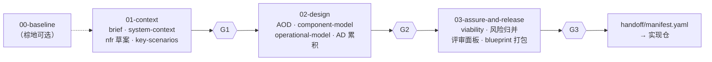
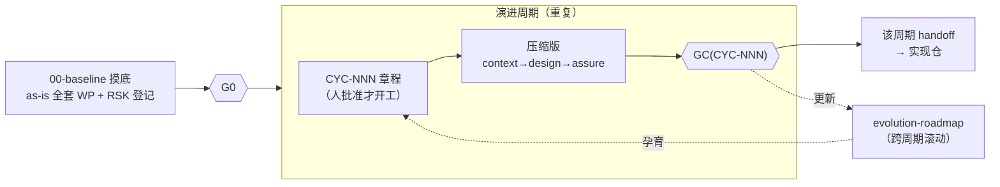

# 02 · 生命周期与门禁（lifecycles & gates）

## 1. 剖面 A · engagement（项目型，线性）



| 阶段 | 主产出 | 出口门禁冻结什么 |
|---|---|---|
| `01-context` | system-context、nfr-catalog（草案）、key-scenario | **G1**：范围与"关键"共识——system-context 与 key-scenario 升 `baselined@G1` |
| `02-design` | architecture-overview、component-model、operational-model、AD 持续累积、NFR 裁定 | **G2**：设计共识——设计类 WP 升 `baselined@G2`，全部 must 级 NFR 有裁定 |
| `03-assure-and-release` | viability 核查（G3 checklist 章节）、RSK 归并、遗留 OQ 清零、blueprint 打包 | **G3**：范围内 WP 升 `released`，产出 handoff manifest，项目终结 |

对应 IBM GS Method：`01`≈Solution Outline，`02`≈Macro Design，`03`≈保障与发布。

## 2. 剖面 B · product（产品型，摸底 + 周期循环）



- **00-baseline**：对现有系统逆向产出 as-is WP（system-context / architecture-overview / component-model / operational-model / nfr-catalog 现状实测），技术债与风险入 `RSK-NNN`。G0 签核后 as-is WP 直接升 `released` ——"现状真相"确立，下游从此有据可依。
- **演进周期 CYC-NNN**：
  1. 章程（`cycles/CYC-NNN-<slug>.md`）：触发源 / 范围 / `affected_wps`（含目标版本与最低状态）/ 不做什么。**章程经 `/arch-decide` 人批准**（LEDGER 记 `CYC-NNN opened`）后才可开工。
  2. 周期内用 `/arch-change` 推进受影响 WP 的新版本（to-be）；AD/OQ 照常累积。
  3. **GC 门禁**：gate.py 按章程 `affected_wps` 动态解析必备项；签核后范围内 WP 升 `released`（supersede 旧版），LEDGER 记 `GATE-CYC-NNN closed`，产出该周期 handoff manifest。
  4. 每次 GC 后更新 `evolution-roadmap`（唯一不随周期冻结的 WP）。
- **as-is / to-be 的表达**：不设新字段。as-is = 各 WP 最新 `released` 版本；to-be = 在途的 `draft/review/baselined` 版本。实现验证落地后 to-be 晋升 `released` 并 `supersedes` 旧版。

## 3. 门禁规程（两剖面通用）

每次过门 = **三层，顺序固定，缺一不过**：

1. **确定性检查**（机器）：`python3 tools/gate.py --gate <G0|G1|G2|G3|CYC-NNN>` 全绿。检查什么见 gate-config.json 与 `04-notation-and-style.v1.md` §4。
2. **评审面板**（agent，作者≠审查者）：按 `gates/` 下对应 checklist 实例化，强制并行运行 4 视角只读 subagent（security / performance / operability / data，提示词=中枢 `templates/gates/perspectives/`）。findings 写入 gate 实例文件；**视角间冲突不由 agent 调停，自动登记 OQ**。释放类门禁（G0/G3/GC）额外含 viability 强制章节。
3. **人签核**：`/arch-gate` 汇总以上产出签核请求（完成度 / findings / 已裁与未裁 OQ / 风险），人**会话内复述确认**后，LEDGER 落 `GATE-*` 记录，WP 状态按 gate-config `promote_to` 晋升。

**前置约束**：域内（本阶段/本周期 scope 的）`OQ` 尚有 open → `/arch-gate` 拒绝产出签核请求，转引 `/arch-decide` 先清账。

**判定语义**：

| verdict | 含义 | 后续 |
|---|---|---|
| `pass` | 无保留通过 | WP 晋升，进入下一阶段/关闭周期 |
| `pass-with-conditions` | 带条件通过 | WP 晋升，**条件逐条登记为 OQ（needs:human）或 RSK 携 due（needs:agent）**，下一 gate 的 gate.py 检查其已销账 |
| `fail` | 不通过 | 记录缺口，回 `/arch-change`；gate 可重复运行 |

**签核记录格式**（项目 LEDGER）：

```
### GATE-G1
- date: 2026-07-12
- verdict: pass-with-conditions
- conditions: OQ-009（缓存策略月底前裁）
- scope: system-context.v2, key-scenario.v1, nfr-catalog.v1
```

**批准粒度**：人签核批准的是 **WP 版本**（`baselined@G1` = "system-context v2 整体被 G1 批准"），不做段落级归属。事后要改 → 起 `vN+1`，改动自然重新进入下一次门禁的辖域。
