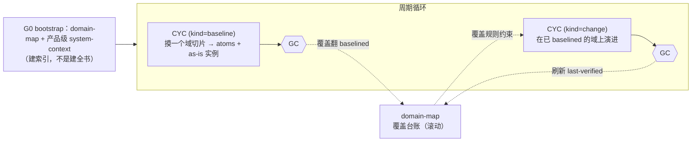

# 02 · 生命周期与门禁（lifecycles & gates）· v2

> 相对 v1 的变更：product 剖面从"全量摸底 G0"重构为**渐进式摸底**（G0 瘦身为 bootstrap 门 + baseline 型周期切片生长 + 覆盖规则），周期章程引入 `kind/domains/instance`。engagement 剖面不变。全量摸底退化为"一个 baseline 周期覆盖全部域"的特例，v1 时代的 G0 记录仍有效。

## 1. 剖面 A · engagement（项目型，线性）——同 v1

`01-context` → **G1** → `02-design` → **G2** → `03-assure-and-release` → **G3**（handoff，项目终结）。棕地可选前置 baseline 周期。阶段主产出与冻结物见 v1 §1（此处不重复，v1 该节继续有效引用）。

## 2. 剖面 B · product（产品型）——渐进式摸底 + 周期循环

**哲学**：baseline 不是一个要做完的阶段，而是一部持续生长的 wiki（method/06）。**摸到哪、改到哪；永远不被改到的域永远不用摸；但绝不在盲区里做设计决策。**

- **G0 bootstrap 门**：只要求 `domain-map v1`（划分完整、每域一行、覆盖状态如实——允许全部 unmapped/mapped）+ 产品级 `system-context v1`。签核语义 = **"划分方式与负空间被人认可"**。签核后二者升 `baselined@G0`。
- **周期章程 v2**：frontmatter 增 `kind: baseline | change` 与 `domains: [...]`；`affected_wps` 条目可带 `instance: <domain>`（解析域实例文件 `<slug>.<domain>.vN.md`）。
- **baseline 型周期**：主产出 = 该域 atoms（经 ingest 管线）+（该域将进 change 周期时）as-is WP 域实例。GC 签核后：范围内 as-is 实例升 `released`，**domain-map 该域覆盖翻 `baselined`**。首刀选择由真实诉求倒逼：想改哪/哪出事故 → 摸它 + domain-map 关系列上的最小依赖闭包。
- **change 型周期**：**覆盖规则（gate.py 机检）**——章程 `domains` 必须全部 `baselined`；想动未摸的域 → 先开 baseline 周期，或混合章程（同周期先摸后改，affected_wps 同时含 as-is 与 to-be 目标）。
- **新鲜度**：GC 关闭时刷新所触域 `last-verified`；超阈值 → `stale`，`/arch-status` 提示 refresh（开 baseline 周期或并入下次 change）。
- as-is / to-be 表达同 v1：as-is = 最新 `released`，to-be = 在途版本。

## 3. 滚动维护 WP 的版本语义

`domain-map` 与 `evolution-roadmap` 是**滚动文档**：日常行级更新（覆盖翻转、gap 消化）属勘误级就地修订；**升大版本仅当重新划分域 / 方向重大调整**。其余 WP 仍守"改 baselined/released 必起新版"。

## 4. 门禁规程——三层结构同 v1，两处扩展

1. **确定性检查**扩为**六查**：v1 五查 + ⑥ `kb-index.py --check`（项目无 kb/ 时跳过）；GC 对 change 型章程加覆盖规则对照（domain-map 表）。
2. **评审面板 / 人签核 / verdict 语义 / 批准粒度**：同 v1 §3（继续有效）。
3. **GC 签核后新增动作**（arch-gate 执行）：按章程 kind 翻转/刷新 domain-map 覆盖行；baseline 型周期产出的域 MOC 围栏须最新（⑥ 查兜底）。
