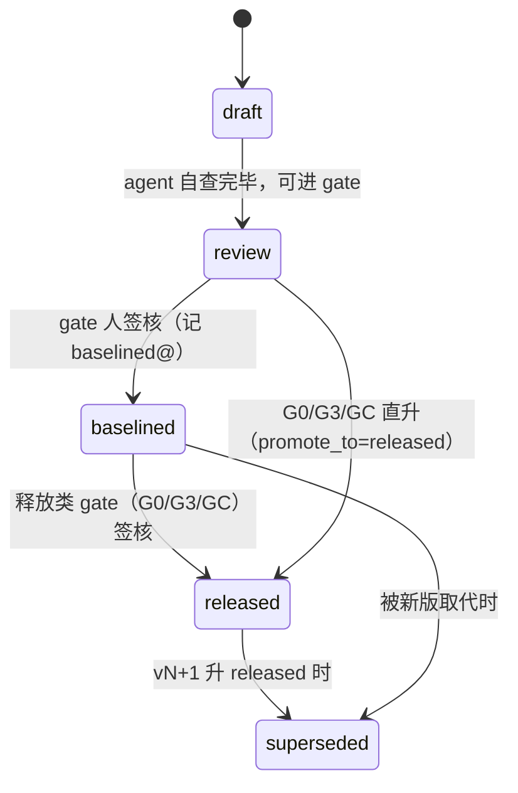

# 04 · 记法与文风（notation & style）

## 1. WP 状态机



- 完整枚举：`draft | review | baselined@<G0|G1|G2|G3|CYC-NNN> | released | superseded`。
- 状态**只前进不后退**：要"退回"就起新版本（vN+1 从 draft 开始）。
- **下游（实现仓）只消费 `released`**。
- as-is / to-be 解读（product 模式）：as-is = 最新 `released`；to-be = 在途 `draft/review/baselined`。

## 2. WP 实例 frontmatter schema（项目仓）

```yaml
---
wp: component-model            # WP 类型 slug（8 类之一）
version: 2                     # 与文件名 .v2.md 一致（gate.py 校验）
status: review                 # §1 枚举
supersedes: component-model.v1.md   # 首版 null
superseded_by: null
blocked_on: []                 # open 的 OQ id 列表，与正文 [BLOCKED-ON:] 一致
created: 2026-07-08
updated: 2026-07-12
generated_from: system-arch-base@<commit>/templates/work-products/component-model.v1.md
---
```

AD 文件同理，多两条：`ad: AD-003`、`decision_status: proposed | decided | superseded`（`decided` 只能经人裁定产生）。
CYC 章程 frontmatter 见 `templates/cycles/cycle-charter.v1.md`。

## 3. 命名与语言

- 目录/文件/slug/frontmatter 键与值：kebab-case 英文；正文：中文 + 英文术语。
- WP 实例：`work-products/NN-<slug>/<slug>.vN.md`；AD：`decisions/AD-NNN-<slug>.md`；周期：`cycles/CYC-NNN-<slug>.md`。
- ID 一律三位零填充（`OQ-001`）。ID 只增不复用，关闭不回收。
- 图一律 **Mermaid**（C4 用 Mermaid 的 C4 语法或 flowchart 近似），不用 PlantUML、不贴图片截图（不可 diff）。
- 引用锚：仓内用相对路径 + `§章节`；跨仓**只用仓库名 + ID/钉版**，不写本机路径（LG-015）。
- 内联标记：`[BLOCKED-ON: OQ-NNN]`、`[ASSUMES: OQ-NNN=<选项>]`——仅此两种，大写、方括号、可 grep。

## 4. 确定性可检性（gate.py 依赖的约定）

gate.py 之所以能零依赖工作，靠这些**写作纪律**：

1. WP frontmatter 完整且 `version` == 文件名 `vN`；`status` 在枚举内。
2. `blocked_on` 列表与正文 `[BLOCKED-ON:]` 内联标记**双向一致**。
3. LEDGER 条目 = `### <ID> · 标题` 块 + `- key: value` 行（gate.py 按此 grep；不要改写成表格或散文）。
4. 项目 INDEX.md 登记每个 WP 实例的 path/version/status（gate.py 对账）。
5. 每个 gate 的必备 WP 与最低状态在 `gate-config.json`（engagement 静态矩阵；product GC 从章程 `affected_wps` 动态解析）。

**gate.py 刻意不做**：Mermaid 语法校验（引入 node 依赖，破坏零依赖可移植性；图错渲染时可见）、跨 WP 语义一致性（那是评审面板的职责——机器查形，面板查义）。

## 5. 文风

- 每份 WP 开头一段"读者是谁、读完能回答什么"。
- 表格用于可枚举事实；判断与理由写正文。
- 不写"高性能/高可用/灵活扩展"式空话——写不出可度量指标的 NFR 不收。
- 模板中的引导注释（`<!-- ... -->`）在实例定稿（review 及之后）时删除。
