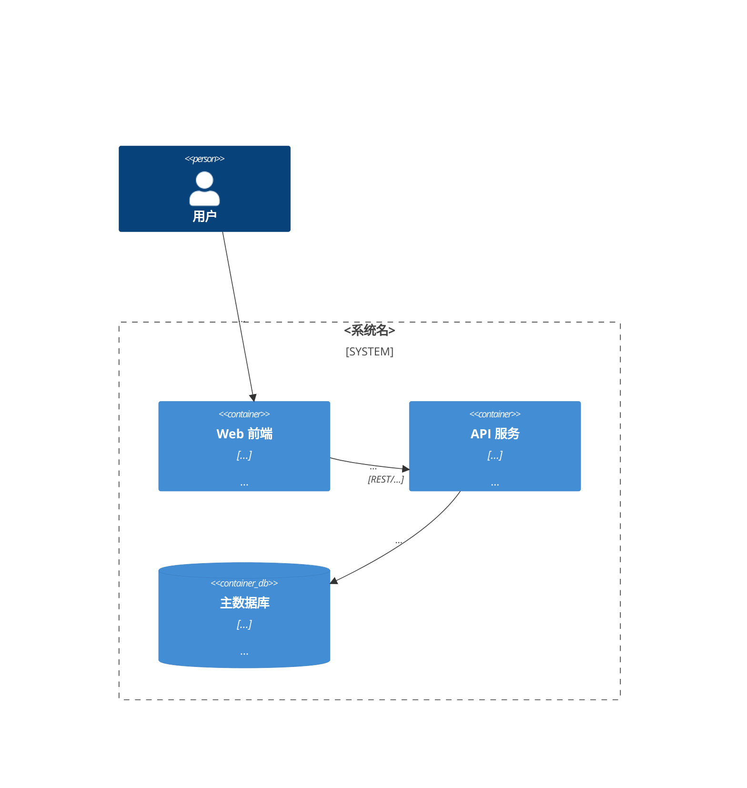

<!-- 实例化说明同 system-context 模板。 -->

```yaml
---
wp: architecture-overview
version: 1
status: draft
supersedes: null
superseded_by: null
blocked_on: []
created: <date>
updated: <date>
generated_from: system-arch-base@<commit>/templates/work-products/architecture-overview.v1.md
---
```

<!-- TEMPLATE-BODY -->
# Architecture Overview (AOD) — <系统名>

> 读者：新加入的工程师 / 管理层。读完能"一张图讲清系统"。IBM 传统中 AOD 刻意**允许不严谨**——它的价值是沟通，不是精确；精确交给 component-model。

## 1. 总览图（C4 L2 容器级）



## 2. 构件职责

<!-- 图中每个元素一段（2–4 句）：它负责什么、为什么单独存在。图上有而这里没有 = DoD 不过。 -->

### <构件名>

## 3. 关键技术选型

<!-- 只列指针，理由在 AD 里。没有 AD 编号的选型 = 还没被决策，不得出现在这里（可以以 [ASSUMES] / [BLOCKED-ON] 出现）。 -->

| 选型点 | 选择 | 依据 |
|---|---|---|
| <如：主数据库> | <PostgreSQL> | AD-001 |

## 4. 横切关注点一览

<!-- 认证/授权、可观测性、配置、错误处理等如何统一处理，各一两句 + 指针。 -->
