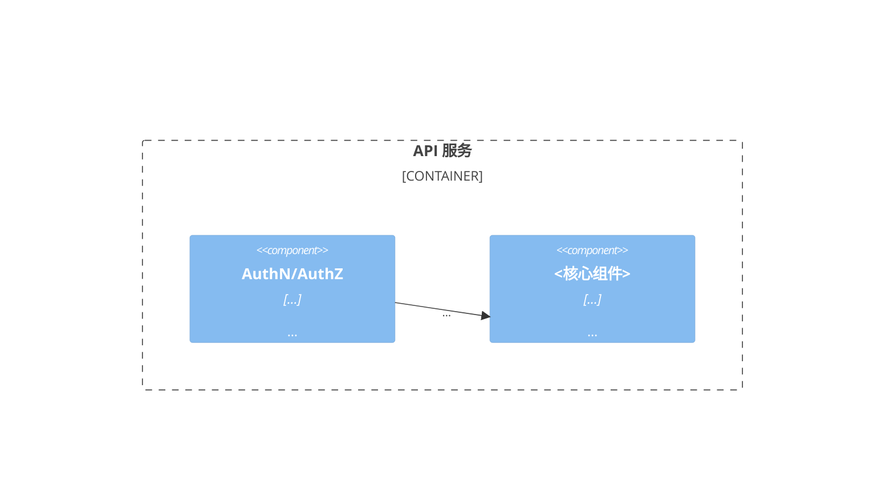
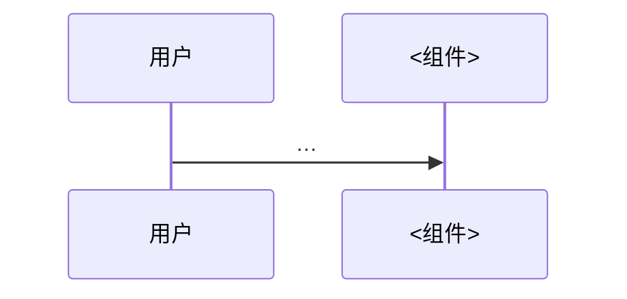

<!-- 实例化说明同 system-context 模板。 -->

```yaml
---
wp: component-model
version: 1
status: draft
supersedes: null
superseded_by: null
blocked_on: []
created: <date>
updated: <date>
generated_from: system-arch-base@<commit>/templates/work-products/component-model.v1.md
---
```

<!-- TEMPLATE-BODY -->
# Component Model — <系统名>

> 读者：实现团队。IBM 传统的静态（组件与职责）+ 动态（协作时序）双视图。静态回答"有什么"，动态回答"怎么一起工作"——**只有动态视图能暴露静态划分的错误**。

## 1. 静态视图（C4 L3）



## 2. 组件职责与接口

<!-- 每组件一行"单一职责陈述"——写不成一句话说明职责不单一。接口列它对外承诺的形状（指向契约定义处，不复述细节）。 -->

| 组件 | 单一职责陈述 | 对外接口 | 依赖 |
|---|---|---|---|
| | | | |

## 3. 动态视图（关键场景时序）

<!-- 覆盖 key-scenario 中全部 priority=must 的场景，每个一张 sequence。走图时发现"这步该谁做说不清"→ 回改静态划分。 -->

### SCN-001 <场景名>



## 4. 设计依据

<!-- 划分依据的 AD 指针（如按领域划分 vs 按技术层划分 → AD-NNN）。 -->
