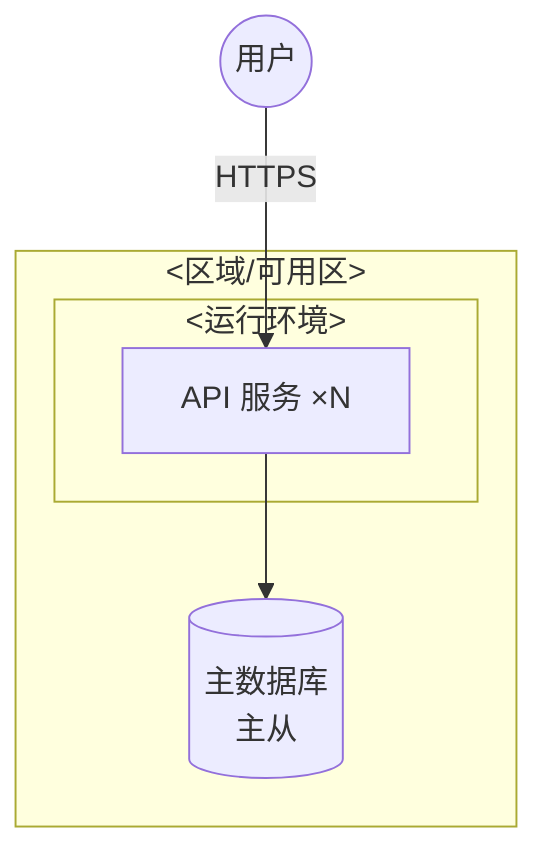

<!-- 实例化说明同 system-context 模板。
     v1 刻意单级（IBM 原教旨是 LOM/SOM/POM 三级）：部署拓扑 + 环境矩阵 + 容量假设。
     当项目真的需要做基础设施规格与成本核算时，是本模板升 v2 分级的信号——先在中枢 LEDGER 记 MD 再升。 -->

```yaml
---
wp: operational-model
version: 1
status: draft
supersedes: null
superseded_by: null
blocked_on: []
created: <date>
updated: <date>
generated_from: system-arch-base@<commit>/templates/work-products/operational-model.v1.md
---
```

<!-- TEMPLATE-BODY -->
# Operational Model — <系统名>

> 读者：运维/平台/实现团队。回答：部署到哪、怎么连、怎么活下来。component-model 中每个组件必须在 §1 有落点（DoD）。

## 1. 部署拓扑



<!-- 每条跨信任边界的连接标注：协议 / 加密 / 认证方式。 -->

## 2. 部署单元 × 组件映射

| 部署单元 | 承载的组件 | 副本/规格假设 | 位置 |
|---|---|---|---|
| | | | |

## 3. 环境矩阵

| | dev | staging | prod |
|---|---|---|---|
| 拓扑差异 | | | |
| 数据 | | | |

## 4. 可用性与容量假设

<!-- 与 nfr-catalog 对齐：这里写"为满足 NFR-NNN 所做的部署假设"，指标本身在 NFR 目录不复述。 -->

| 假设 | 依据（NFR/AD 指针） | 验证方式 |
|---|---|---|
| | | |
