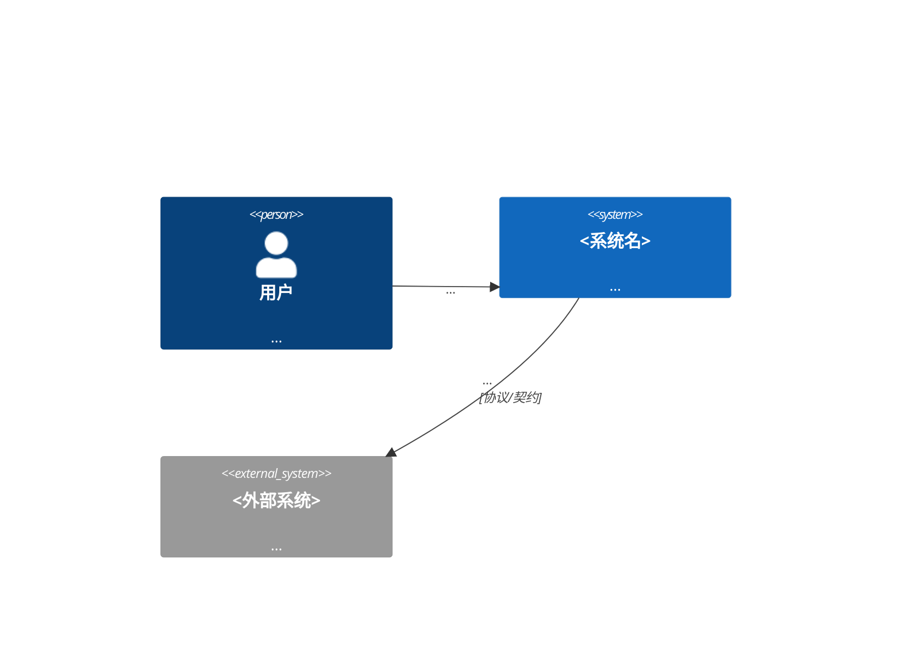

<!-- 模板自身的版本信息在上方；实例化（/arch-change）时：复制 TEMPLATE-BODY 以下全部内容，
     并以下面 yaml 块为实例 frontmatter（填实值）。引导注释在实例进入 review 前删除。 -->

```yaml
---
wp: system-context
version: 1
status: draft
supersedes: null
superseded_by: null
blocked_on: []
created: <date>
updated: <date>
generated_from: system-arch-base@<commit>/templates/work-products/system-context.v1.md
---
```

<!-- TEMPLATE-BODY -->
# System Context — <系统名>

> 读者：所有干系人。读完能回答：这个系统是什么、边界在哪、为谁存在、依赖谁、**不做什么**。

## 1. Engagement Brief（立项要素）

<!-- IBM 传统里这是独立 intake 阶段的产物；本方法并入此处（MD-003）。product 模式摸底时写"现状为什么需要架构介入"。 -->

- **目标**：<一段话：做成什么样算成功>
- **成功判据**：<可度量，2–4 条；写不出度量就还没想清楚>
- **时间盒**：<engagement：起止日期；product：本 baseline/周期的时间预期>
- **干系人**：

| 干系人 | 角色 | 关切 | 决策权 |
|---|---|---|---|
| | | | |

- **约束**：<预算/技术栈/合规/团队能力等硬约束，每条注明来源>

## 2. 系统上下文图（C4 L1）



## 3. Actors 与外部系统清单

| 名称 | 类型（actor/external system） | 职责一句话 | 交互方向 | 契约性质（API/文件/事件/人肉） |
|---|---|---|---|---|
| | | | | |

## 4. 范围（in / out）

<!-- out-of-scope 是本 WP 最有价值的部分——G1 冻结的主要就是它。 -->

- **In scope**：
- **Out of scope**（显式不做，写明为什么）：

## 5. 开放问题

<!-- 指向 LEDGER 的 OQ 条目，不在此展开：如 "缓存边界未定 → OQ-003"。 -->
